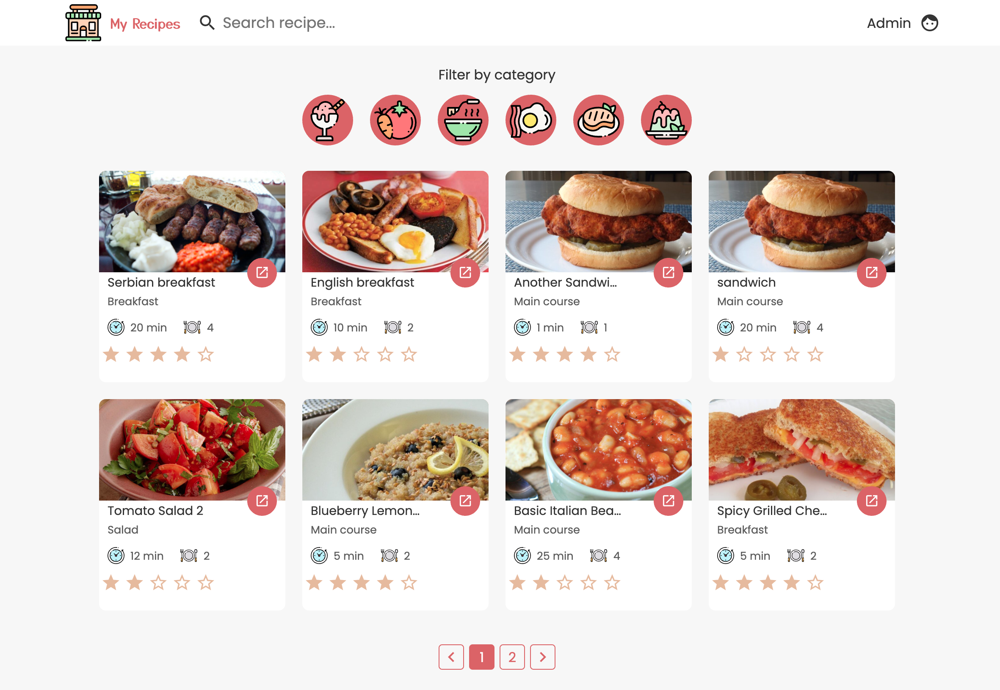
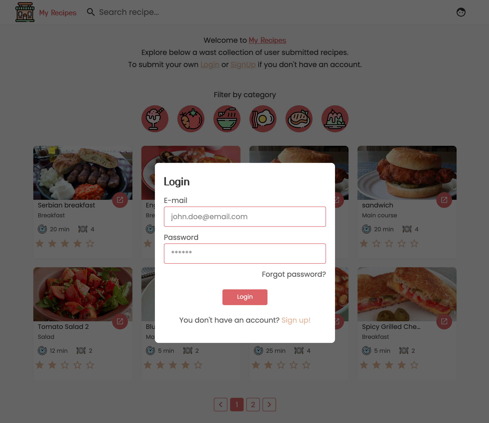
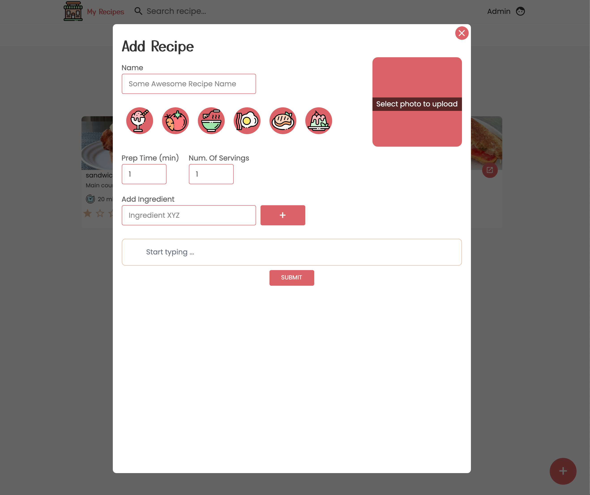

# My Recipe App

This is a personal project which I tried to build using the MERN stack.

  <h3>
    <a href="https://my-recipes-front.netlify.app/">
      Demo
    </a>
  </h3>

   Check backend at: <a href="https://github.com/Boki87/my-recipes-api" target="_blank">https://github.com/Boki87/my-recipes-api</a>.

## Screenshots

### Landing page

### Login modal

### New Recipe Modal

## Features:
* User can search recipes by name
* User can filter recipes by category
* User can login/register
* Logged in User can create new Recipes
* Logged in User can rate other User's recipes
* Logged in User can save recipes to favorites

## Main packages used: 
1. React
2. React Router Dom
3. Styled Components
4. React Toastify
5. React Paginate
6. Framer Motion

## TODO's

1. Make mobile friendly (responsive)
2. fix animations on page transition

